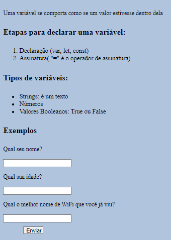

<h1 align="center"> Javascript Course  </h1>

  <a href="#-technologies">Technologies</a>&nbsp;&nbsp;&nbsp;|&nbsp;&nbsp;&nbsp;
  <a href="#-project">Project</a>&nbsp;&nbsp;&nbsp;|&nbsp;&nbsp;&nbsp;
  <a href="#memo-license">License</a>

  

 

  

## 🚀 Topics

This project covered the following topics:

- Variables :negative_squared_cross_mark:
- If statements :grey_question:
- Functions :telephone:
- Error handling :european_post_office:
- Await :raised_hand:
- ...

## 💻 Project

This Javascript course contains a lot of information about this essential language for devs.

- [Access the finished project, online](https://smoothemerson.github.io/Javascript-Course/)

- [Watch class](https://www.youtube.com/watch?v=8dWL3wF_OMw&t=27947s)

## :memo: License

This project is under the MIT license.
